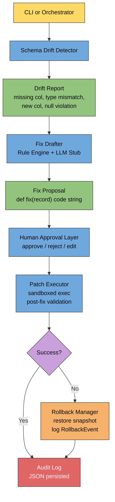

# Self-Healing Data Pipeline Agent

An agentic ETL pipeline that detects schema drift in incoming data batches, automatically drafts transformation fixes using a rule-based engine with a mocked LLM fallback, gates every mutation behind human approval, executes patches in a sandboxed environment, and rolls back automatically on failure — all with a full audit trail.

---

## Features

- **Schema drift detection** — classifies four drift types: `missing_column`, `type_mismatch`, `new_column`, and `null_violation`
- **Automated fix drafting** — a rule-based engine covers common cases; unknown patterns fall back to a mocked LLM stub that returns canned code
- **Human-in-the-loop approval** — every proposed patch must be explicitly approved, rejected, or edited before execution
- **Sandboxed patch execution** — patch code runs inside an isolated `exec` namespace; no side effects without approval
- **Post-fix schema validation** — the drift detector re-runs after each patch to verify residual drift is eliminated
- **Automatic rollback** — state is snapshotted before every patch; failures restore the last known-good state and log a `RollbackEvent`
- **Structured audit trail** — every execution attempt and rollback is persisted to JSON logs
- **Orchestrator agent loop** — cycles through all mock drift scenarios automatically in non-interactive mode
- **CLI entry point** — `list-scenarios`, `detect`, `etl`, and `run` sub-commands with scenario selection flags
- **Comprehensive pytest suite** — 130+ tests covering every layer (Days 1–7)

---

## Architecture



---

## Installation

Python 3.10 or later is required. No external dependencies beyond the standard library and `pytest`.

```bash
# Clone the repository
git clone <repo-url>
cd self-healing-pipeline

# Install in editable mode (includes dev dependencies)
pip install -e ".[dev]"
```

---

## Usage

All commands are available through the `src.cli` module.

### List available drift scenarios

```bash
python -m src.cli list-scenarios
```

```
Available drift scenarios (7):
  orders_missing_column
  orders_type_mismatch
  orders_new_column
  orders_null_violation
  orders_multi_drift
  users_null_violation
  users_new_column
```

### Detect drift for a specific scenario

```bash
python -m src.cli detect --scenario orders_type_mismatch
```

```
[DriftReport] table='orders'  n_rows=2  drift_items=1
  [type_mismatch] column='customer_id'  row=0  expected='int'  actual='str'
```

### Run the ETL pipeline for a table

```bash
python -m src.cli etl --table orders
python -m src.cli etl --table users
```

### Run the full self-healing orchestrator loop

```bash
# All scenarios (auto-approve, writes report to ./output/)
python -m src.cli run

# Specific scenarios only
python -m src.cli run --scenarios orders_type_mismatch orders_null_violation

# Custom output directory
python -m src.cli run --scenarios orders_multi_drift --output-dir /tmp/pipeline_out
```

The `run` command exits with code `0` when all patches succeed and `1` when any failure occurs.

### Run tests

```bash
# Full test suite
pytest

# One day's tests
pytest tests/test_day5.py -v

# Specific test class
pytest tests/test_day7.py::TestEndToEnd -v
```

### Quick smoke test (script)

```bash
python scripts/run_pipeline.py
```

---

## Project Structure

```
self-healing-pipeline/
├── data/
│   └── schema_registry.json        # Expected schemas for orders and users tables
├── src/
│   ├── cli.py                       # CLI entry point (list-scenarios, detect, etl, run)
│   ├── pipeline/
│   │   ├── mock_source.py           # Simulated upstream data source (orders, users batches)
│   │   └── etl.py                   # Extract → Transform → Load stages + in-memory sink
│   ├── registry/
│   │   └── schema_registry.py       # Schema load, save, register, and infer
│   ├── drift/
│   │   ├── detector.py              # SchemaDriftDetector, DriftReport, DriftItem, DriftType
│   │   └── mock_drift_batches.py    # Canned drifted batches for all 7 scenarios
│   ├── drafter/
│   │   ├── fix_drafter.py           # FixDrafter agent orchestrating rule engine + LLM stub
│   │   ├── rule_engine.py           # Rule-based fix templates (type cast, null fill, drop column)
│   │   ├── prompt_template.py       # LLM prompt renderer with search token embedding
│   │   └── llm_stub.py              # Mocked LLM returning canned code strings
│   ├── approval/
│   │   └── confirmation.py          # ApprovalSession, ApprovalRecord, Decision, _write_patch
│   ├── executor/
│   │   └── patch_executor.py        # PatchExecutor, AuditLog, sandboxed exec helpers
│   ├── rollback/
│   │   └── rollback_manager.py      # RollbackManager, PipelineSnapshot, RollbackEvent, RollbackLog
│   └── orchestrator/
│       └── agent_loop.py            # OrchestratorAgent, RunReport, ScenarioResult
├── tests/
│   ├── test_day1.py                 # ETL pipeline + schema registry
│   ├── test_day2.py                 # Drift detector + mock batches
│   ├── test_day3.py                 # Fix drafter, rule engine, LLM stub, prompt template
│   ├── test_day4.py                 # Human-in-the-loop approval layer
│   ├── test_day5.py                 # Patch executor + audit log
│   ├── test_day6.py                 # Rollback manager + snapshots
│   └── test_day7.py                 # Orchestrator loop, CLI, end-to-end
├── scripts/
│   └── run_pipeline.py              # Smoke-test script (no drift, clean ETL run)
├── pyproject.toml
└── README.md
```

---

## How It Works

### 1 — Schema Registry (`src/registry/schema_registry.py`)

The registry loads `data/schema_registry.json`, which declares expected column names, Python types (`str`, `int`, `float`, `bool`), nullability, and optional constraints for each table. It can also infer and register a schema from a sample batch via `infer_and_register()`.

### 2 — Mock ETL Pipeline (`src/pipeline/`)

`mock_source.py` provides deterministic in-memory batches for the `orders` and `users` tables. `etl.py` implements the three pipeline stages (extract → transform → load) writing to an in-memory sink. This represents the "production" pipeline that the agent watches over.

### 3 — Drift Detection (`src/drift/detector.py`)

`SchemaDriftDetector.detect(table, batch)` compares an incoming batch against the registry and emits a `DriftReport` containing zero or more `DriftItem` objects. Each item carries a `DriftType`, the affected column name, and the first offending row index. Only one item per column per drift type is emitted to avoid noise.

**Drift types:**

| Type | Trigger |
|---|---|
| `missing_column` | A registered column is absent from every batch row |
| `type_mismatch` | A column's runtime type does not match the registered type |
| `new_column` | A batch column is not present in the registry |
| `null_violation` | A non-nullable column contains `None` |

### 4 — Fix Drafter (`src/drafter/`)

`FixDrafter.draft(report)` iterates over every `DriftItem` and produces one `FixProposal` per item containing a `def fix(record: dict) -> dict` code string.

**Rule engine first:** `rule_engine.apply_rules()` matches on `(drift_type, registered_type)` and renders a template (e.g. cast to `int`, fill `None` with `0.0`, call `record.pop(col)`).

**LLM stub fallback:** when no rule matches, `prompt_template.render_prompt()` builds a structured prompt embedding a `DRIFT_TYPE:column` search token, and `llm_stub.call_llm()` pattern-matches that token to return a canned code snippet. In production this call would go to a real LLM API.

### 5 — Human Approval Layer (`src/approval/confirmation.py`)

`ApprovalSession.run()` iterates over proposals and calls `_prompt_for_proposal()` for each one. The human sees a unified diff of the proposed code and chooses:

- **`a` / `approve`** — accept the proposed code as-is
- **`r` / `reject`** — discard the proposal (with an optional note)
- **`e` / `edit`** — type a replacement code block, review a diff, and confirm

Approved and edited patches are written to versioned `.py` files in a `patches/` directory. An `ApprovalRecord` (with timestamp, decision, code, and patch path) is returned for every proposal. Only approved records proceed to execution.

All interactive `input()` calls accept an injectable `_input_fn` parameter, making the layer fully testable without mocking builtins.

### 6 — Patch Executor (`src/executor/patch_executor.py`)

`PatchExecutor.execute(record)` runs the approved patch through four steps:

1. **Compile** — `compile(code, "<patch>", "exec")` — raises `SyntaxError` on bad code
2. **Exec** — runs in an isolated namespace `{"__builtins__": __builtins__}`; the `fix` symbol is extracted and verified callable
3. **Apply** — `fix` is called row-by-row on the batch; per-row exceptions are caught and the original row is preserved
4. **Validate** — the drift detector re-runs on the output records; any residual drift causes the result to be marked as failed

Every result (success or failure) is appended to an `AuditLog` which optionally flushes to a JSON file after each entry.

### 7 — Rollback Manager (`src/rollback/rollback_manager.py`)

`RollbackManager` wraps the executor with snapshot-and-restore logic:

1. Before each patch, a `PipelineSnapshot` (deep copy of the current table records) is stored in memory and optionally persisted to `snapshots/`
2. The executor runs
3. If execution **succeeds**, the current state is updated with the output records
4. If execution **fails** (error or residual drift), the snapshot is restored and a `RollbackEvent` is appended to the `RollbackLog`

`current_state(table)` always returns a copy, guaranteeing snapshot independence. `execute_many_with_rollback()` applies the same logic across a list of records.

### 8 — Orchestrator Agent Loop (`src/orchestrator/agent_loop.py`)

`OrchestratorAgent.run(scenario_names)` is the top-level agent loop:

1. Load the named drift scenarios (or all of them when `scenario_names` is `None`)
2. For each scenario: detect drift → draft fixes → auto-approve all proposals → execute with rollback
3. Collect results into a `ScenarioResult` per scenario
4. Aggregate into a `RunReport` and persist it as a timestamped JSON file in `output/`

In `auto_approve=True` mode (the default for CLI and tests) every proposal is wrapped in an `ApprovalRecord` with `Decision.APPROVE` without any terminal interaction, allowing the full loop to run unattended.

---

## Notes and Roadmap

### Current limitations

- **Mock data only** — `mock_source.py` and `mock_drift_batches.py` stand in for a real data warehouse; plugging in a real source requires implementing a compatible batch provider callable
- **LLM stub** — `llm_stub.py` pattern-matches on a fixed list of `(drift_type, column)` combinations; unrecognised patterns return a pass-through `fix`; a real LLM integration would replace `call_llm()`
- **Single-column fixes** — each `FixProposal` addresses exactly one drift item; multi-column compound fixes are not yet supported
- **In-memory state** — the rollback manager's live state is not persisted between process restarts; production use would need a persistent state store
- **No constraint enforcement** — the schema registry stores constraints (`min`, `allowed_values`, etc.) but the drift detector does not yet check them; only type, nullability, and column presence are validated

### Possible extensions

- Swap `llm_stub.call_llm()` for a real OpenAI / Anthropic / local-model call
- Add a `--interactive` flag to `run` that routes each proposal through the terminal `ApprovalSession` instead of auto-approving
- Implement constraint-level drift checks (range violations, enum mismatches)
- Persist rollback snapshots and current state to SQLite or a file-backed store for durability across restarts
- Emit structured metrics (drift counts, fix success rates) to a monitoring endpoint
- Support streaming / incremental batches rather than fixed in-memory lists
- Add a web-based approval UI as an alternative to the terminal prompt